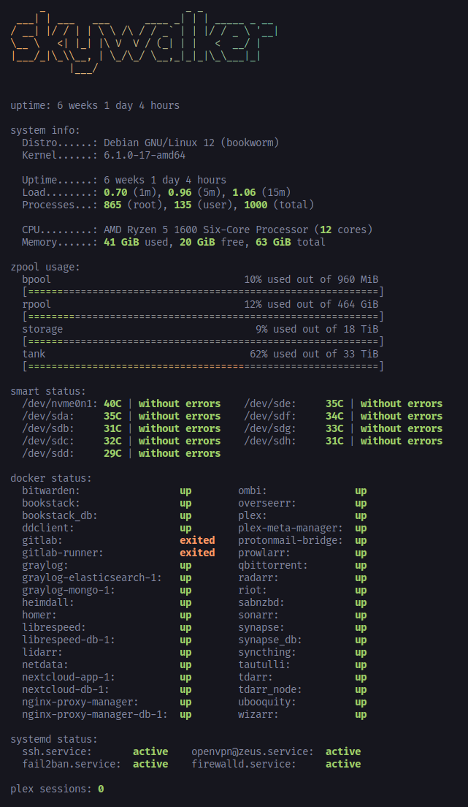

# gmotd

## ☕️ About
`gmotd` is a configurable, dynamic motd generator, written in go.

## 🚀 Installation
```
# using go directly
$ go install github.com/jon4hz/gmotd@latest

# from aur (btw)
$ yay -S gmotd-bin

# local pkg manager
$ VERSION=v0.1.0

## debian / ubuntu
$ dpkg -i gmotd-$VERSION-linux-amd64.deb

## rhel / fedora / suse
$ rpm -i gmotd-$VERSION-linux-amd64.rpm

## alpine
$ apk add --allow-untrusted gmotd-$VERSION-linux-amd64.apk

# homebrew (macOS & linux)
$ brew install jon4hz/homebrew-tap/gmotd
```

## ✨ Usage

### 📦 Standalone
You can use gmotd as standalone binary by executing `gmotd`.
```
$ gmotd
```

### 🔌 PAM
To automatically display the message of the day, you can use the `pam_exec` module to execute `gmotd`.  
For example by adding the following line to `/etc/pam.d/sshd`.
```
session    optional     pam_exec.so stdout /usr/bin/gmotd
```

## 📝 Configuration
`gmotd` loads it's configuration from the following locations:

1. `gmotd.yml`
2. `~/.config/gmotd/gmotd.yml`
3. `/etc/gmotd/gmotd.yml`

First come, first serve.


## 📸 Preview


## 🥂 Credits
- [yboetz/motd](https://github.com/yboetz/motd) (not sure if you'll notice any similarities tho)
